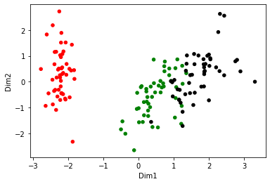
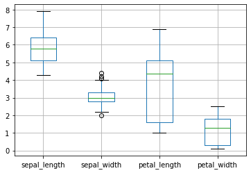

# AUT-Datamining-projects
Projects and pratical assignments for data mining course at AUT, spring 2022

## Projects:
- [Preprocessing iris flower dataset](https://github.com/hedzd/AUT-Datamining-projects/tree/main/Preprocess_IRIS_dataset)
- Neural network
     - [Circles classification](https://github.com/hedzd/AUT-Datamining-projects/blob/main/Neural_Network/circles_classification.ipynb)  
     - [Classification fashion mnist dataset ](https://github.com/hedzd/AUT-Datamining-projects/blob/main/Neural_Network/fashion_mnist.ipynb)
- [Clustring](https://github.com/hedzd/AUT-Datamining-projects/tree/main/Clustering)
-  [Assosiation rules](https://github.com/hedzd/AUT-Datamining-projects/tree/main/Association_Rules)
-  [Final project](https://github.com/hedzd/AUT-Datamining-projects/tree/main/Final_Project)

## Preprocessing iris flower dataset:
Various pre-processings were done in this project.
1. Missing values were recognized and dropped
2. **One-hot encoding** have been used for encoding _categorical features_
3. _Numerical features_ were normalized using **StandardScaler** 
4. **Principal Component Analysis (PCA)** have been used for dimensionality reduction (4D to 2D)
5. Reduced features have been visualized
6. Original Dataset(without NaN-values) have been visualized using Box plot
### Results:
**PCA output**  

  
  
**Features boxplot**  

## Circles classification:

## Classification fashion mnist dataset:

## Clustring:

## Assosiation rules:

## Final project
